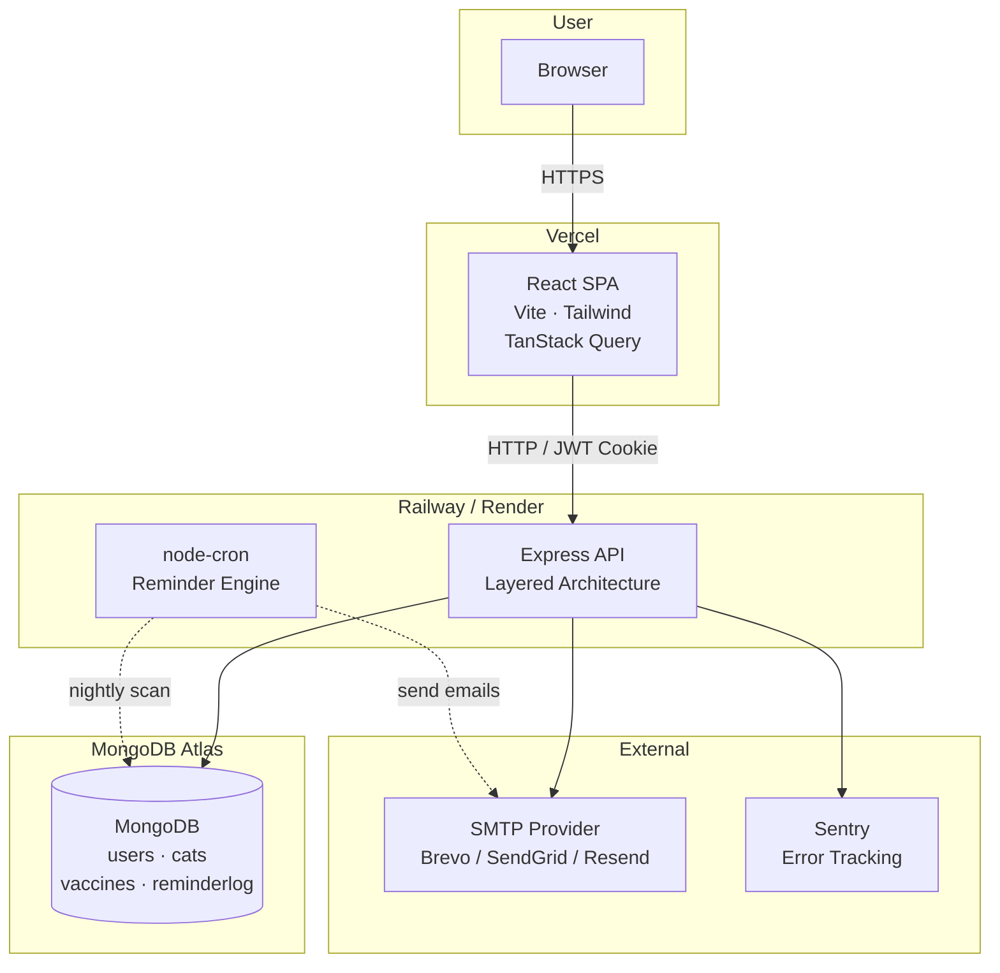
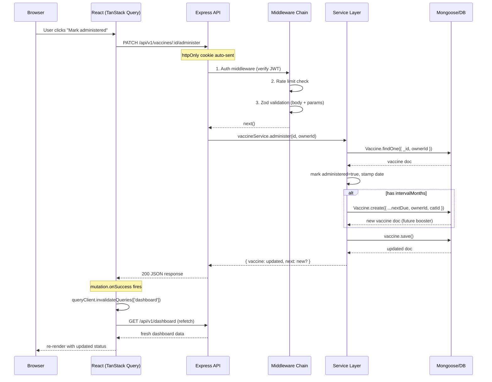
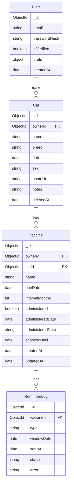
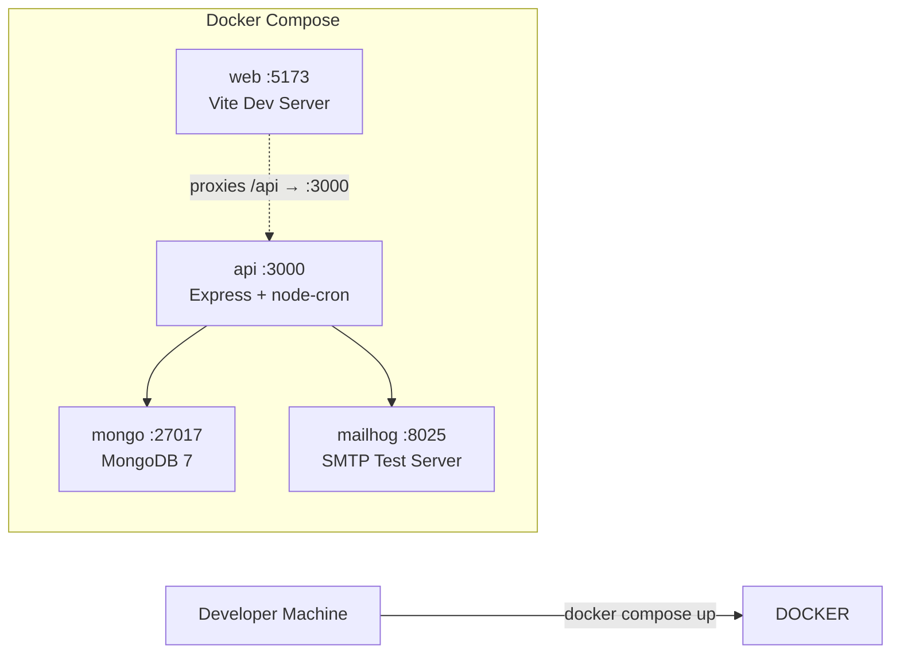
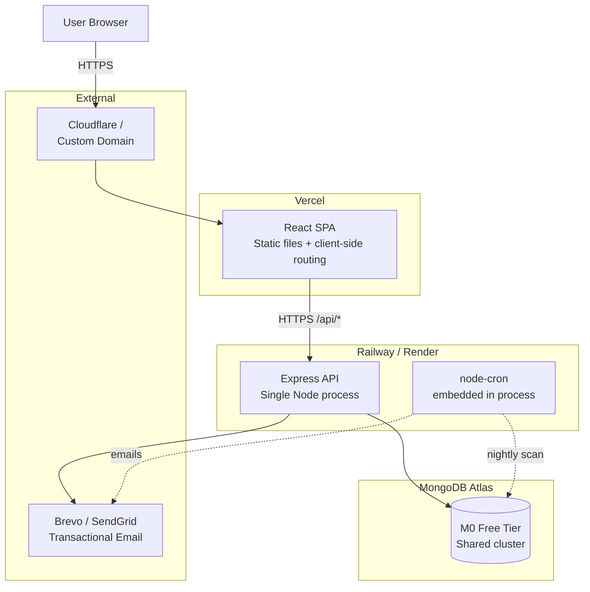
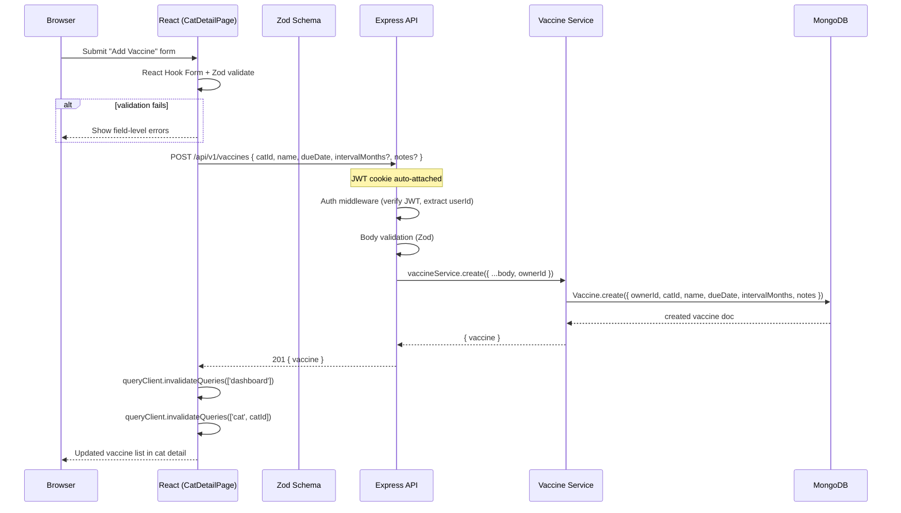
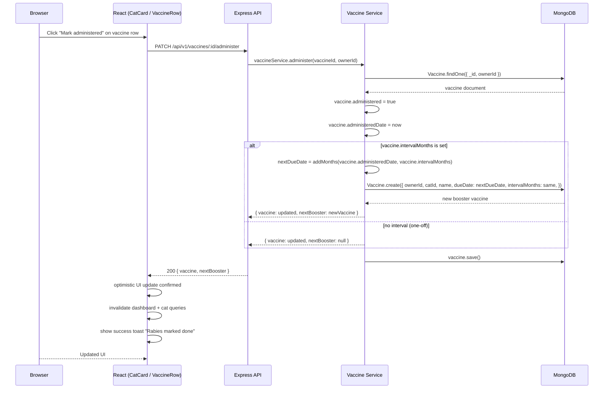
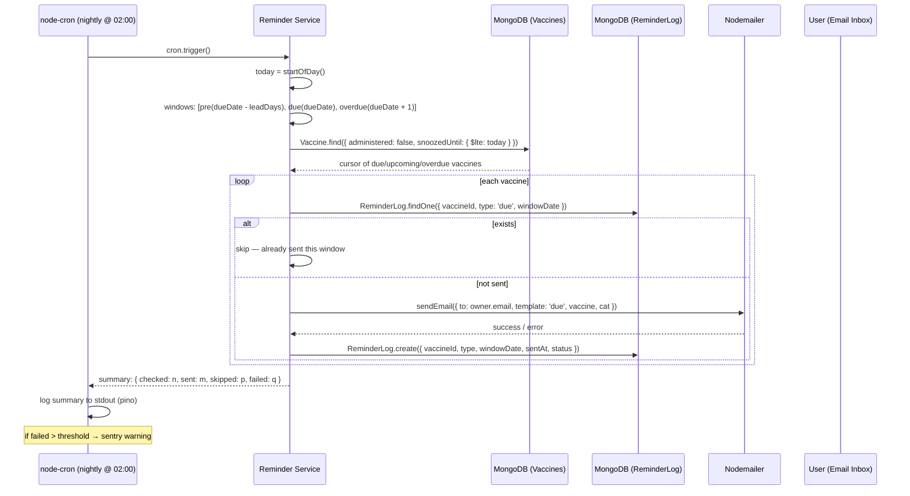
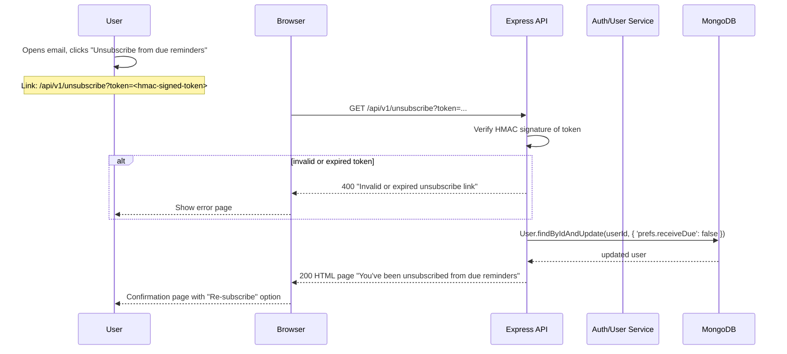

# Architecture Document — CatVac
**Version:** MVP v1.0 · Status: Draft

---

## 1. System Architecture (Logical View)

The system follows a **three-tier architecture** with an additional background scheduling layer embedded in the same process:

```
┌──────────────────────────────────────────────────────┐
│                   CLIENT TIER                         │
│           React SPA (Vite) · Tailwind CSS             │
│  ┌──────────┐  ┌──────────┐  ┌─────────────────────┐ │
│  │  Auth     │  │Dashboard │  │ Cat / Vaccine Mgmt  │ │
│  │  Pages    │  │  Page    │  │     Pages            │ │
│  └────┬─────┘  └────┬─────┘  └─────────┬───────────┘ │
│       │              │                  │              │
│  ┌────┴──────────────┴──────────────────┴───────────┐ │
│  │            TanStack Query + React Context         │ │
│  └───────────────────────┬──────────────────────────┘ │
│                          │                            │
│             HTTP (fetch) │ JWT in httpOnly cookie      │
└──────────────────────────┼────────────────────────────┘
                           │
┌──────────────────────────┼────────────────────────────┐
│                API TIER  │                            │
│         Express (Node LTS) · helmet · cors · pino     │
│                          │                            │
│  ┌───────────────────────┴──────────────────────────┐ │
│  │             Middleware Chain                       │ │
│  │  Rate-Limit → Auth → Validation → Error Handler  │ │
│  └───────────────────────┬──────────────────────────┘ │
│                          │                            │
│  ┌───────────────────────┴──────────────────────────┐ │
│  │          Route → Controller → Service → Model     │ │
│  │  ┌──────┐ ┌──────┐ ┌──────┐ ┌──────┐            │ │
│  │  │Auth  │ │ Cats │ │Vac-  │ │Remin-│             │ │
│  │  │Routes│ │Routes│ │cines │ │der   │             │ │
│  │  └──┬───┘ └──┬───┘ └──┬──┘ └──┬──┘             │ │
│  │     └─────────┼────────┼────────┘                 │ │
│  │               ▼        ▼                          │ │
│  │         Service Layer (business logic)            │ │
│  └───────────────────────────────────────────────────┘ │
│                          │                            │
│  ┌───────────────────────┴──────────────────────────┐ │
│  │           Reminder Engine (node-cron)             │ │
│  │  Runs nightly in the same Express process.       │ │
│  │  Queries Vaccines → checks ReminderLog → sends   │ │
│  │  via Nodemailer → logs result.                   │ │
│  └───────────────────────┬──────────────────────────┘ │
│                          │                            │
└──────────────────────────┼────────────────────────────┘
                           │
┌──────────────────────────┼────────────────────────────┐
│                  DATA TIER │                           │
│           MongoDB Atlas (M0 free tier)                 │
│                          │                            │
│  ┌───────────────────────┴──────────────────────────┐ │
│  │  Collections: users │ cats │ vaccines │ reminderlog│
│  └───────────────────────────────────────────────────┘ │
└─────────────────────────────────────────────────────────┘
                           │
┌──────────────────────────┴────────────────────────────┐
│           EXTERNAL SERVICES                            │
│  ┌──────────────┐  ┌──────────────┐  ┌──────────────┐ │
│  │  SMTP Relay  │  │   Sentry    │  │  Render /    │ │
│  │  (Brevo /    │  │  (errors)   │  │  Railway     │ │
│  │   SendGrid)  │  │             │  │  (hosting)   │ │
│  └──────────────┘  └──────────────┘  └──────────────┘ │
└────────────────────────────────────────────────────────┘
```

**Key architectural decision:** The reminder engine co-exists in the API process rather than as a separate service. Acceptable for MVP scale (≤1000 users). The pattern can be extracted into a dedicated worker in Phase 2 when Redis/BullMQ is introduced.

---

## 2. Top-Level System Overview (Container Diagram)



---

## 3. Design Methodology

### 3.1 RESTful API
- Resources mapped to URL paths: `/api/v1/auth/*`, `/api/v1/cats/*`, `/api/v1/vaccines/*`, `/api/v1/dashboard`
- Standard HTTP verbs: GET (read), POST (create), PATCH (partial update), DELETE (delete)
- Collection vs item distinction: `GET /cats` (list), `GET /cats/:id` (single)
- Nesting for child resources: `GET /cats/:catId/vaccines`
- Status codes: 200 (success), 201 (created), 204 (deleted), 400 (validation), 401 (unauthorized), 403 (forbidden), 404 (not found), 429 (rate limited), 500 (server error)

### 3.2 Layered Architecture (Backend)
Each request flows through strict layers with single responsibility:

```
Request → [Route] → [Middleware] → [Controller] → [Service] → [Model] → MongoDB
```

| Layer | Responsibility | Dependencies |
|---|---|---|
| Route | URL mapping, HTTP method, parameter extraction | Express Router |
| Middleware | Auth, rate-limit, validation, logging, error handling | Express middleware functions |
| Controller | Request parsing, response formatting, status code selection | None (thin) |
| Service | Business logic, orchestration, domain rules (e.g. administer + reschedule) | Models, other services |
| Model | Data schema, indexes, virtuals, instance methods | Mongoose |

### 3.3 Mobile-First Frontend
- Component-driven (React functional components + hooks)
- Server state managed by TanStack Query (cache, invalidation, optimistic updates)
- UI state managed by React Context (auth, theme, toasts)
- Card-based layout (no tables) for all viewports

### 3.4 Pragmatic MVP Approach
- Avoid premature abstraction. Shared logic is extracted only when the third repetition occurs.
- No monorepo tooling — `client/` and `server/` are sibling directories with separate `package.json` files.
- Seed scripts and Docker compose enable one-command local development.

---

## 4. Design Patterns

### 4.1 Backend Patterns

#### 4.1.1 Middleware Chain
```javascript
// app.js — middleware registration order matters
app.use(requestLogger)       // pino http logger
app.use(helmet())            // security headers
app.use(cors({ origin }))    // restrict to frontend origin
app.use(rateLimit(authOpts)) // 5/min on /auth/*
app.use('/api/v1', router)
app.use(notFoundHandler)     // 404 for unknown routes
app.use(errorHandler)        // centralized error formatting
```

#### 4.1.2 Route → Controller → Service → Model
```
/routes/auth.routes.js       — POST /login, POST /signup, POST /logout
  → /controllers/auth.controller.js   — parse req.body, call service, send res
    → /services/auth.service.js       — hash password, generate JWT, handle errors
      → /models/user.model.js         — Mongoose schema, bcrypt pre-save hook
```

#### 4.1.3 DTO / Validation Boundary (Zod)
```javascript
// vaccines.routes.js
router.patch('/:id/administer', validate(administerSchema), vaccineController.administer)

// schemas/vaccine.schema.js (shared between controller and service)
export const createVaccineSchema = z.object({
  catId: z.string().length(24),
  name: z.string().min(1).max(100),
  dueDate: z.string().datetime(),
  intervalMonths: z.number().int().positive().nullable().optional(),
  notes: z.string().max(500).optional(),
})
```

#### 4.1.4 Repository-like Service Layer
Services abstract Mongoose queries so controllers never call models directly:

```javascript
// services/vaccine.service.js
async function administer(vaccineId, ownerId) {
  const vaccine = await Vaccine.findOne({ _id: vaccineId, ownerId })
  if (!vaccine) throw new NotFoundError('Vaccine not found')
  return vaccineService.administer(vaccine) // marks done, optionally creates next
}
```

#### 4.1.5 Error Handling Pattern
```javascript
// Central error classes
class AppError extends Error { constructor(message, statusCode) }
class NotFoundError extends AppError { constructor(msg) { super(msg, 404) } }
class ValidationError extends AppError { constructor(msg) { super(msg, 400) } }

// Central error middleware
function errorHandler(err, req, res, next) {
  const status = err.statusCode || 500
  req.log.error({ err, status }, 'request failed')
  res.status(status).json({
    error: { message: err.message, code: err.code || 'INTERNAL_ERROR' }
  })
}
```

#### 4.1.6 Idempotent Cron Job
The reminder engine uses a `ReminderLog` collection as an idempotency token:

```javascript
// Each vaccine + type + dateWindow combo is unique
const existing = await ReminderLog.findOne({ vaccineId, type, windowDate })
if (existing) return // already sent

await sendEmail(...)
await ReminderLog.create({ vaccineId, type, windowDate, sentAt: new Date() })
```

### 4.2 Frontend Patterns

#### 4.2.1 Container / Presenter
```
Pages (containers):
  /pages/LoginPage.jsx       — handles form submit, auth context
  /pages/DashboardPage.jsx   — fetches dashboard data, passes to presentational
  /pages/CatDetailPage.jsx   — fetches cat + vaccines, orchestrates CRUD

Components (presentational):
  /components/CatCard.jsx    — renders single cat with vaccine list
  /components/VaccineRow.jsx — renders vaccine name, status pill, actions
  /components/StatusPill.jsx — color-coded pill based on status prop
```

#### 4.2.2 Server State via TanStack Query
```javascript
// hooks/useDashboard.js
export function useDashboard() {
  return useQuery({
    queryKey: ['dashboard'],
    queryFn: () => fetch('/api/v1/dashboard').then(r => r.json()),
    staleTime: 30_000, // 30s before refetch
  })
}

// After marking a vaccine administered:
const queryClient = useQueryClient()
const mutation = useMutation({
  mutationFn: (id) => fetch(`/api/v1/vaccines/${id}/administer`, { method: 'PATCH' }),
  onSuccess: () => queryClient.invalidateQueries({ queryKey: ['dashboard'] }),
})
```

#### 4.2.3 Auth via React Context
```javascript
const AuthContext = createContext()
function AuthProvider({ children }) {
  const [user, setUser] = useState(null)
  const login = async (email, pw) => { ... setUser(user) }
  const logout = async () => { ... setUser(null) }
  return <AuthContext.Provider value={{ user, login, logout }}>...
}

function ProtectedRoute({ children }) {
  const { user } = useAuth()
  if (!user) return <Navigate to="/login" />
  return children
}
```

#### 4.2.4 Optimistic Updates
For marking a vaccine administered, the UI updates immediately before the server confirms:

```javascript
const mutation = useMutation({
  mutationFn: administerVaccine,
  onMutate: async (id) => {
    await queryClient.cancelQueries({ queryKey: ['dashboard'] })
    const previous = queryClient.getQueryData(['dashboard'])
    queryClient.setQueryData(['dashboard'], (old) => /* optimistically update */)
    return { previous }
  },
  onError: (err, id, context) => {
    queryClient.setQueryData(['dashboard'], context.previous) // rollback
  },
})
```

---

## 5. Data Flow (Request/Response Lifecycle)



---

## 6. Entity-Relationship Diagram



### Indexes

| Collection | Index | Purpose |
|---|---|---|
| `vaccines` | `{ ownerId: 1, catId: 1, dueDate: 1 }` | Dashboard per-cat query |
| `vaccines` | `{ dueDate: 1, administered: 1 }` | Cron scan for vaccines needing reminders |
| `vaccines` | `{ ownerId: 1, dueDate: 1 }` | Owner-wide sorted queries |
| `users` | `{ email: 1 }` (unique) | Login lookup |
| `reminderlog` | `{ vaccineId: 1, type: 1, windowDate: 1 }` (unique) | Idempotency enforcement |

---

## 7. Deployment Topology

### 7.1 Development (Local — Docker Compose)



`docker-compose.yml` structure:
```yaml
services:
  api:
    build: ./server
    ports: ["3000:3000"]
    env_file: ./server/.env
    depends_on: [mongo, mailhog]

  web:
    build: ./client
    ports: ["5173:5173"]
    depends_on: [api]

  mongo:
    image: mongo:7
    ports: ["27017:27017"]
    volumes: ["mongo_data:/data/db"]

  mailhog:
    image: mailhog/mailhog
    ports: ["1025:1025", "8025:8025"]

volumes:
  mongo_data:
```

**Local email testing:** Mailhog catches all SMTP traffic. View emails at `http://localhost:8025`.

### 7.2 Production (Railway + Vercel + Atlas)



**Production details:**

| Component | Host | Notes |
|---|---|---|
| **React SPA** | Vercel | Static deployment, client-side routing via `rewrites`, env: `VITE_API_URL` (set to your production API origin, same-origin via `rewrites` recommended over CORS) |
| **Express API** | Railway / Render | Single Node process. `SMTP_*` env, `MONGODB_URI`, `JWT_SECRET`, `SENTRY_DSN` |
| **MongoDB** | Atlas M0 | IP whitelist (Railway egress), `MONGODB_URI` in API env |
| **SMTP** | Brevo / SendGrid | API key in env. Dev: Mailhog locally |
| **Email DNS** | SPF + DKIM | Required for inbox delivery. Configured in SMTP provider dashboard |

**Environment variables (production):**
```
NODE_ENV=production
PORT=3000
MONGODB_URI=mongodb+srv://...
JWT_SECRET=<random-64-char>
JWT_EXPIRES_IN=7d
SMTP_HOST=smtp.sendgrid.net
SMTP_PORT=587
SMTP_USER=apikey
SMTP_PASS=<sendgrid-api-key>
FROM_EMAIL=reminders@catvac.app
SENTRY_DSN=https://...
FRONTEND_ORIGIN=https://catvac.app
```

---

## 8. Sequence Diagrams

### 8.1 Login Flow

```mermaid
sequenceDiagram
    participant B as Browser
    participant R as React (LoginPage)
    participant API as Express API
    participant S as Auth Service
    participant M as MongoDB
    participant L as LocalStorage

    B->>R: Submit email + password
    R->>API: POST /api/v1/auth/login { email, password }

    API->>S: authService.login(email, password)
    S->>M: User.findOne({ email })
    M-->>S: user doc (with passwordHash)

    S->>S: bcrypt.compare(password, user.passwordHash)
    alt invalid password
        S-->>API: throw UnauthorizedError
        API-->>R: 401 { error: "Invalid credentials" }
        R-->>B: Show error toast
    end

    S->>S: jwt.sign({ userId, email }, secret, { expiresIn: '7d' })
    S-->>API: { token, user }

    API->>API: Set httpOnly cookie: `token=...; HttpOnly; Secure; SameSite=Lax; Path=/; Max-Age=604800`
    API-->>R: 200 { user: { id, email, prefs } }

    R->>L: Store user info (NOT token)
    R->>R: Update AuthContext, redirect to /dashboard
    B-->>R: Dashboard renders
```

### 8.2 Add Vaccine Flow



### 8.3 Administer + Auto-Reschedule



### 8.4 Nightly Cron Reminder Run



### 8.5 Unsubscribe Flow



---

## 9. Key Implementations

### 9.1 JWT Authentication (httpOnly Cookie)

**Why httpOnly cookies instead of localStorage:**
- Immune to XSS token theft (JavaScript cannot read the cookie)
- Auto-attached to same-origin requests
- `Secure` flag ensures HTTPS-only transmission
- `SameSite=Lax` prevents CSRF from cross-site POST

**Token structure:**
```javascript
const token = jwt.sign(
  { userId: user._id.toString(), email: user.email },
  process.env.JWT_SECRET,
  { expiresIn: '7d' }
)
```

**Cookie setter:**
```javascript
res.cookie('token', token, {
  httpOnly: true,
  secure: process.env.NODE_ENV === 'production',
  sameSite: 'lax',
  path: '/',
  maxAge: 7 * 24 * 60 * 60 * 1000, // 7 days
})
```

**Auth middleware:**
```javascript
async function authMiddleware(req, res, next) {
  const token = req.cookies?.token
  if (!token) return next(new UnauthorizedError('Not authenticated'))

  try {
    const payload = jwt.verify(token, process.env.JWT_SECRET)
    req.userId = payload.userId
    next()
  } catch {
    next(new UnauthorizedError('Invalid or expired token'))
  }
}
```

### 9.2 Vaccine Status Derivation

Status is computed server-side on every query, not stored as a field:

```javascript
function computeStatus(vaccine, leadDays = 7) {
  const today = startOfDay(new Date())
  const due = startOfDay(vaccine.dueDate)
  const diffDays = differenceInDays(due, today)

  if (vaccine.administered) return 'administered'
  if (vaccine.snoozedUntil && vaccine.snoozedUntil > today) return 'snoozed'
  if (diffDays < 0) return 'overdue'
  if (diffDays === 0) return 'due'
  if (diffDays <= leadDays) return 'upcoming'
  return 'on-track'
}
```

**Dashboard aggregation endpoint** uses this function to return pre-computed statuses:

```javascript
async getDashboard(ownerId) {
  const cats = await Cat.find({ ownerId, deletedAt: null })
  const vaccines = await Vaccine.find({ ownerId }).sort({ dueDate: 1 })
  const user = await User.findById(ownerId)

  return cats.map(cat => ({
    cat,
    vaccines: vaccines
      .filter(v => v.catId.equals(cat._id))
      .map(v => ({ ...v.toObject(), status: computeStatus(v, user.prefs.leadDays) }))
  }))
}
```

### 9.3 Auto-Reschedule on Administer

```javascript
async administer(vaccineId, ownerId) {
  const vaccine = await Vaccine.findOne({ _id: vaccineId, ownerId })
  if (!vaccine) throw new NotFoundError('Vaccine not found')
  if (vaccine.administered) throw new ValidationError('Already administered')

  vaccine.administered = true
  vaccine.administeredDate = new Date()

  let nextBooster = null
  if (vaccine.intervalMonths) {
    nextBooster = await Vaccine.create({
      ownerId,
      catId: vaccine.catId,
      name: vaccine.name,
      dueDate: addMonths(vaccine.administeredDate, vaccine.intervalMonths),
      intervalMonths: vaccine.intervalMonths,
    })
  }

  await vaccine.save()
  return { vaccine, nextBooster }
}
```

### 9.4 HMAC-Signed Unsubscribe Token

Tokens are self-contained (no DB lookup needed for verification):

```javascript
function generateUnsubscribeToken(userId, email, type) {
  const payload = `${userId}:${email}:${type}`
  const hmac = crypto.createHmac('sha256', process.env.UNSUBSCRIBE_SECRET)
                      .update(payload)
                      .digest('hex')
  return Buffer.from(`${payload}:${hmac}`).toString('base64url')
}

function verifyUnsubscribeToken(token) {
  const decoded = Buffer.from(token, 'base64url').toString()
  const [userId, email, type, ...hmacParts] = decoded.split(':')
  const providedHmac = hmacParts.join(':')

  const expected = crypto.createHmac('sha256', process.env.UNSUBSCRIBE_SECRET)
                         .update(`${userId}:${email}:${type}`)
                         .digest('hex')

  if (!crypto.timingSafeEqual(Buffer.from(expected), Buffer.from(providedHmac))) {
    throw new ValidationError('Invalid unsubscribe token')
  }
  return { userId, email, type }
}
```

### 9.5 Snooze Logic

```javascript
async snooze(vaccineId, ownerId, days = 30) {
  const vaccine = await Vaccine.findOne({ _id: vaccineId, ownerId })
  if (!vaccine) throw new NotFoundError('Vaccine not found')

  vaccine.snoozedUntil = addDays(new Date(), days)
  await vaccine.save()
  return vaccine
}
```

Snoozed vaccines are filtered out in the cron query:
```javascript
Vaccine.find({
  administered: false,
  $or: [
    { snoozedUntil: null },
    { snoozedUntil: { $lte: new Date() } }, // snooze expired
  ],
  dueDate: { $lte: futureWindow },
})
```

### 9.6 Reminder Engine (node-cron)

```javascript
import cron from 'node-cron'
import { reminderService } from './services/reminder.service.js'

export function startReminderEngine() {
  // Run every night at 02:00
  cron.schedule('0 2 * * *', async () => {
    const logger = pino().child({ module: 'reminder-engine' })
    logger.info('Starting nightly reminder scan')

    try {
      const summary = await reminderService.processReminders()
      logger.info({ summary }, 'Reminder scan complete')
    } catch (err) {
      logger.error({ err }, 'Reminder scan failed')
      Sentry.captureException(err)
    }
  })
}
```

`reminderService.processReminders()` iterates over applicable vaccines, checks `ReminderLog` for idempotency, sends email, and logs the result.

---

## 10. Security Boundaries

| Layer | Control | Implementation |
|---|---|---|
| **Transport** | HTTPS only | Enforced in production via Vercel + Railway. HSTS header via Helmet. |
| **Cookie** | httpOnly + Secure + SameSite | JWT token in cookie. Cannot be read by JS. Not sent cross-site. |
| **CORS** | Origin allowlist | `cors({ origin: FRONTEND_ORIGIN })` — only the React domain. |
| **Rate Limiting** | Auth endpoints | `express-rate-limit` — 5 requests/min on `/auth/login`, `/auth/signup`. |
| **Data Scoping** | ownerId filter | Every query includes `ownerId: req.userId`. Users cannot access other users' data. |
| **Secrets** | Environment variables | All secrets (JWT secret, DB URI, SMTP password) via env. Never committed. |
| **Validation** | Zod schemas | All input validated at the controller boundary. Type coercion + constraints. |
| **Headers** | Helmet middleware | CSP, X-Frame-Options, X-Content-Type-Options, etc. |
| **Password** | bcrypt (cost ≥ 12) | Hashed before storage. Never logged. |
| **Email Security** | DKIM/SPF | Configured at SMTP provider for deliverability + anti-spoofing. |
| **GDPR** | Deletion endpoint | Hard-deletes user + all associated data within 30 days of request. |

---

## 11. Error Handling & Observability

### 11.1 Central Error Middleware

```javascript
function errorHandler(err, req, res, next) {
  const status = err.statusCode || 500
  const code = err.code || 'INTERNAL_ERROR'

  req.log.error({ err, status, reqId: req.id }, 'request error')

  if (status >= 500) {
    Sentry.captureException(err, { tags: { reqId: req.id } })
  }

  res.status(status).json({
    error: {
      message: err.message || 'Internal server error',
      code,
      ...(process.env.NODE_ENV === 'development' && { stack: err.stack }),
    },
  })
}
```

### 11.2 Structured Logging (pino)

```javascript
// request-scoped logger
app.use((req, res, next) => {
  req.log = pino().child({ reqId: nanoid(), method: req.method, url: req.url })
  next()
})

// cron logger
cronLogger.info({ checked: 120, sent: 5, skipped: 114, failed: 1 }, 'reminder-run')
```

### 11.3 Observability Summary

| Tool | Purpose | Where |
|---|---|---|
| **pino** | Structured JSON logs to stdout | API server + cron |
| **Sentry** | Error tracking + performance | Frontend + backend |
| **Cron heartbeat** | Log start/finish/summary each run | Reminder engine |
| **Uptime check** | HTTP GET /health every 5 min | UptimeRobot or similar |

### 11.4 Health Endpoint

```javascript
app.get('/api/v1/health', async (req, res) => {
  const dbStatus = await mongoose.connection.readyState === 1 ? 'ok' : 'error'
  res.json({
    status: 'ok',
    timestamp: new Date().toISOString(),
    db: dbStatus,
    uptime: process.uptime(),
  })
})
```

---

## 12. Cross-Cutting Concerns (Middleware Ordering)

Middleware registration order in `app.js` determines execution sequence. The correct order is critical:

```javascript
// 1. Request identification & logging (lowest risk, always runs)
app.use(requestId())
app.use(requestLogger)

// 2. Security headers (must run before any content generation)
app.use(helmet())

// 3. CORS — must run before route matching
app.use(cors({ origin: FRONTEND_ORIGIN, credentials: true }))

// 4. Body parsing — needed by most routes
app.use(express.json({ limit: '10kb' }))

// 5. Cookie parsing — needed by auth middleware
app.use(cookieParser())

// 6. Rate limiting — applied selectively via middleware factory
app.use('/api/v1/auth', rateLimit(authLimiterOptions))

// 7. Routes — auth routes first (no auth middleware), then protected routes
app.use('/api/v1/auth', authRoutes)
app.use('/api/v1', authMiddleware)   // gates everything below
app.use('/api/v1/cats', catRoutes)
app.use('/api/v1/vaccines', vaccineRoutes)
app.use('/api/v1/dashboard', dashboardRoutes)
app.use('/api/v1/unsubscribe', unsubscribeRoutes)

// 8. 404 handler — catches unmatched routes
app.use(notFoundHandler)

// 9. Central error handler — always last
app.use(errorHandler)
```

**Why this order matters:**
- Logging and security headers should run on every request, even those that fail later.
- CORS must be set before any response is sent (preflight handling).
- Body parsers before route handlers.
- Rate limiting applied only to high-risk paths (auth).
- Auth middleware as a single gating point before all protected routes — no per-route `authMiddleware` calls needed.
- Error handler last so it catches errors from every preceding layer.

---

## 13. Project Directory Structure

```
catvac/
├── client/                          # React SPA (Vite)
│   ├── public/
│   │   └── favicon.ico
│   ├── src/
│   │   ├── components/              # Presentational components
│   │   │   ├── CatCard.jsx
│   │   │   ├── VaccineRow.jsx
│   │   │   ├── StatusPill.jsx
│   │   │   ├── Toast.jsx
│   │   │   └── ...
│   │   ├── pages/                   # Page containers
│   │   │   ├── LoginPage.jsx
│   │   │   ├── DashboardPage.jsx
│   │   │   ├── CatDetailPage.jsx
│   │   │   └── ...
│   │   ├── hooks/                   # Custom hooks
│   │   │   ├── useAuth.js
│   │   │   ├── useDashboard.js
│   │   │   ├── useVaccines.js
│   │   │   └── ...
│   │   ├── context/                 # React Context
│   │   │   └── AuthContext.jsx
│   │   ├── lib/                     # Utilities
│   │   │   ├── api.js               # fetch wrapper
│   │   │   └── validators.js        # Zod schemas (duplicated)
│   │   ├── App.jsx
│   │   └── main.jsx
│   ├── index.html
│   ├── vite.config.js
│   ├── tailwind.config.js
│   ├── postcss.config.js
│   └── package.json
│
├── server/                          # Express API
│   ├── src/
│   │   ├── routes/                  # Express routers
│   │   │   ├── auth.routes.js
│   │   │   ├── cat.routes.js
│   │   │   ├── vaccine.routes.js
│   │   │   ├── dashboard.routes.js
│   │   │   └── unsubscribe.routes.js
│   │   ├── controllers/             # Request handlers
│   │   │   ├── auth.controller.js
│   │   │   ├── cat.controller.js
│   │   │   ├── vaccine.controller.js
│   │   │   ├── dashboard.controller.js
│   │   │   └── unsubscribe.controller.js
│   │   ├── services/                # Business logic
│   │   │   ├── auth.service.js
│   │   │   ├── cat.service.js
│   │   │   ├── vaccine.service.js
│   │   │   ├── dashboard.service.js
│   │   │   └── reminder.service.js
│   │   ├── models/                  # Mongoose schemas
│   │   │   ├── user.model.js
│   │   │   ├── cat.model.js
│   │   │   ├── vaccine.model.js
│   │   │   └── reminderLog.model.js
│   │   ├── middleware/              # Express middleware
│   │   │   ├── auth.middleware.js
│   │   │   ├── validate.middleware.js
│   │   │   ├── error.middleware.js
│   │   │   └── notFound.middleware.js
│   │   ├── schemas/                 # Zod validation schemas
│   │   │   ├── auth.schema.js
│   │   │   ├── cat.schema.js
│   │   │   └── vaccine.schema.js
│   │   ├── cron/                    # Scheduled jobs
│   │   │   ├── reminder.job.js
│   │   │   └── index.js
│   │   ├── emails/                  # Email templates (HTML strings)
│   │   │   ├── welcome.email.js
│   │   │   ├── predue.email.js
│   │   │   ├── due.email.js
│   │   │   ├── overdue.email.js
│   │   │   ├── administered.email.js
│   │   │   ├── resetPassword.email.js
│   │   │   └── unsubscribe.email.js
│   │   ├── app.js                   # Express app setup
│   │   └── server.js                # Entry point (connect DB, start cron)
│   ├── tests/
│   │   ├── auth.test.js
│   │   ├── vaccine.test.js
│   │   ├── reminder.test.js
│   │   └── ...
│   ├── seed.js                      # Demo data seeder
│   ├── .env.example
│   ├── Dockerfile
│   └── package.json
│
├── docker-compose.yml
├── .gitignore
├── .eslintrc.cjs
├── .prettierrc
├── CONTEXT.md                       # (this directory)
│   ├── PRD.md
│   ├── DESIGN.md
│   └── ARCHITECTURE.md
└── README.md
```

---

## 14. Technology Choices & Rationale

| Choice | Rationale |
|---|---|
| **Express (no Fastify)** | MERN convention. More community resources, simpler middleware ecosystem. Sufficient for MVP scale. |
| **Mongoose (no Prisma)** | Native MongoDB ODM. Schema flexibility for MVP. No migration tooling needed. |
| **Zod (no Joi)** | Lighter, TypeScript-first, composable. Same library used in frontend forms. |
| **TanStack Query (no Redux)** | Server-state focus. Built-in caching, invalidation, optimistic updates. No boilerplate. |
| **Tailwind (no styled-components)** | Zero-runtime. DESIGN.md palette maps to Tailwind config. Fastest iteration. |
| **node-cron (no BullMQ)** | Simplest approach for MVP. Single process, no Redis. Phase 2 → BullMQ if scale demands. |
| **Vite (no CRA)** | Faster dev server, better DX. CRA is deprecated/unmaintained. |
| **Helmet (manual)** | Standard Express security. Sets ~15 HTTP headers. |

---

## 15. Scalability Notes (Phase 2+)

When the user base exceeds ~1000 active households or the single cron process becomes a bottleneck:

1. **Extract reminder engine** into a dedicated worker process (BullMQ + Redis).
2. **Separate API read replicas** — dashboard queries hit a read replica.
3. **Add Redis cache** — dashboard aggregation cached with 30s TTL.
4. **Background job queues** — email sending via BullMQ with retry/exponential backoff/Dead Letter Queue.
5. **Horizontal scaling** — stateless API behind a load balancer (session affinity not needed since JWT is self-contained).
