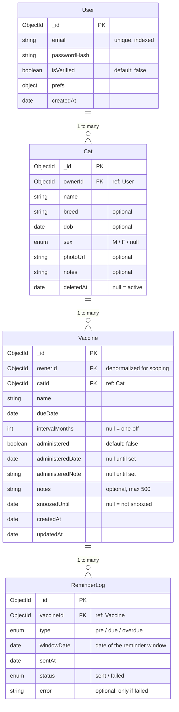

# Database Schema — CatVac
**Database:** MongoDB 7 · Atlas M0 Free Tier  
**ODM:** Mongoose 8+  
**Version:** MVP v1.0 · Status: Draft

---

## 1. Schema Overview

| Collection | Purpose | Avg Doc Size | Retention |
|---|---|---|---|
| `users` | Authentication + notification preferences | ~500 B | Permanent (hard-deleted on GDPR request) |
| `cats` | Cat profiles per household | ~400 B | Soft-deleted (30-day purge window) |
| `vaccines` | Vaccine entries + recurrence tracking | ~350 B | Permanent (hard-deleted with cat or user) |
| `devicetokens` | FCM push notification device tokens | ~200 B | Permanent (hard-deleted with user or on logout) |
| `reminderlog` | Idempotency ledger for reminder engine | ~200 B | TTL auto-delete after 90 days |
| `_migrations` | migrate-mongo state tracking | ~200 B | Permanent (internal) |

---

## 2. Entity-Relationship Diagram



### Denormalization Note

`ownerId` on the `vaccines` collection is **denormalized** (also present on `cats`). This avoids a two-hop lookup (`vaccine → cat → user`) on every dashboard query and cron scan. The tradeoff is a small write-cost increase on vaccine creation — acceptable for MVP scale.

---

## 3. Per-Collection Schemas

### 3.1 `users`

| Field | Type | Required | Default | Constraints | Description |
|---|---|---|---|---|---|
| `_id` | ObjectId | auto | auto | — | Primary key |
| `email` | String | yes | — | unique, lowercase trimmed, max 255 chars, regex validated | Login identifier |
| `passwordHash` | String | yes | — | bcrypt output (60 chars) | Never stored in plaintext |
| `isVerified` | Boolean | no | `false` | — | Email verification flag (stub for MVP) |
| `prefs.leadDays` | Number | no | `7` | min 1, max 30 | How many days before "due" triggers "upcoming" |
| `prefs.receivePreDue` | Boolean | no | `true` | — | Receive pre-due reminders |
| `prefs.receiveDue` | Boolean | no | `true` | — | Receive due-day reminders |
| `prefs.receiveOverdue` | Boolean | no | `true` | — | Receive overdue reminders |
| `createdAt` | Date | auto | `new Date()` | immutable | Doc creation timestamp |

**Mongoose schema:**

```javascript
const userSchema = new mongoose.Schema(
  {
    email: {
      type: String,
      required: true,
      unique: true,
      lowercase: true,
      trim: true,
      maxlength: 255,
      match: /^[^\s@]+@[^\s@]+\.[^\s@]+$/,
    },
    passwordHash: { type: String, required: true },
    isVerified: { type: Boolean, default: false },
    prefs: {
      leadDays: { type: Number, default: 7, min: 1, max: 30 },
      receivePreDue: { type: Boolean, default: true },
      receiveDue: { type: Boolean, default: true },
      receiveOverdue: { type: Boolean, default: true },
    },
  },
  { timestamps: { createdAt: true, updatedAt: false } }
)

userSchema.pre('save', async function (next) {
  if (this.isModified('passwordHash')) {
    // hash is performed in auth.service before assignment
    // this hook validates that the hash looks correct
    if (this.passwordHash.length !== 60) {
      return next(new Error('passwordHash must be a bcrypt hash'))
    }
  }
  next()
})
```

### 3.2 `cats`

| Field | Type | Required | Default | Constraints | Description |
|---|---|---|---|---|---|
| `_id` | ObjectId | auto | auto | — | Primary key |
| `ownerId` | ObjectId | yes | — | ref: `User`, indexed | Owner of this cat profile |
| `name` | String | yes | — | trimmed, min 1, max 100 | Cat's name |
| `breed` | String | no | `null` | max 100 | Breed or "Mixed" |
| `dob` | Date | no | `null` | must be in the past | Date of birth (for age display) |
| `sex` | String | no | `null` | enum: `'M'` \| `'F'` | Biological sex |
| `photoUrl` | String | no | `null` | max 500, URL format | Cat avatar (stored externally) |
| `notes` | String | no | `null` | max 500 | Free-text notes (allergies, vet, etc.) |
| `deletedAt` | Date | no | `null` | — | Soft-delete flag; `null` = active |
| `createdAt` | Date | auto | `new Date()` | immutable | Doc creation timestamp |
| `updatedAt` | Date | auto | `new Date()` | — | Doc update timestamp |

**Mongoose schema:**

```javascript
const catSchema = new mongoose.Schema(
  {
    ownerId: { type: mongoose.Schema.Types.ObjectId, ref: 'User', required: true, index: true },
    name: { type: String, required: true, trim: true, minlength: 1, maxlength: 100 },
    breed: { type: String, default: null, maxlength: 100 },
    dob: { type: Date, default: null, validate: { validator: v => !v || v < new Date(), message: 'DOB must be in the past' } },
    sex: { type: String, default: null, enum: [null, 'M', 'F'] },
    photoUrl: { type: String, default: null, maxlength: 500 },
    notes: { type: String, default: null, maxlength: 500 },
    deletedAt: { type: Date, default: null },
  },
  { timestamps: true }
)

// Query filter: exclude soft-deleted by default
catSchema.pre(/^find/, function () {
  if (!this.getQuery().includeDeleted) {
    this.where({ deletedAt: null })
  }
})
```

### 3.3 `vaccines`

| Field | Type | Required | Default | Constraints | Description |
|---|---|---|---|---|---|
| `_id` | ObjectId | auto | auto | — | Primary key |
| `ownerId` | ObjectId | yes | — | ref: `User`, indexed | Denormalized for fast scoping |
| `catId` | ObjectId | yes | — | ref: `Cat`, indexed | Which cat this vaccine belongs to |
| `name` | String | yes | — | trimmed, min 1, max 100 | e.g. "Rabies", "FVRCP" |
| `dueDate` | Date | yes | — | — | When the next dose is due |
| `intervalMonths` | Number | no | `null` | min 1, max 120 | Recurrence interval; `null` = one-off |
| `administered` | Boolean | no | `false` | — | Whether this occurrence is done |
| `administeredDate` | Date | no | `null` | — | When the vaccine was given |
| `administeredNote` | String | no | `null` | max 500 | Optional note (e.g. batch #, lot) |
| `notes` | String | no | `null` | max 500 | General notes about the vaccine |
| `snoozedUntil` | Date | no | `null` | — | Suppress reminders until this date |
| `createdAt` | Date | auto | `new Date()` | immutable | Doc creation timestamp |
| `updatedAt` | Date | auto | `new Date()` | — | Doc update timestamp |

**Mongoose schema:**

```javascript
const vaccineSchema = new mongoose.Schema(
  {
    ownerId: { type: mongoose.Schema.Types.ObjectId, ref: 'User', required: true, index: true },
    catId: { type: mongoose.Schema.Types.ObjectId, ref: 'Cat', required: true, index: true },
    name: { type: String, required: true, trim: true, minlength: 1, maxlength: 100 },
    dueDate: { type: Date, required: true },
    intervalMonths: { type: Number, default: null, min: 1, max: 120 },
    administered: { type: Boolean, default: false },
    administeredDate: { type: Date, default: null },
    administeredNote: { type: String, default: null, maxlength: 500 },
    notes: { type: String, default: null, maxlength: 500 },
    snoozedUntil: { type: Date, default: null },
  },
  { timestamps: true }
)
```

**Status derivation** (not stored — computed at query time):

```javascript
vaccineSchema.virtual('status').get(function () {
  const today = startOfDay(new Date())
  const due = startOfDay(this.dueDate)
  const diffDays = differenceInDays(due, today)
  const leadDays = 7 // default; dashboard overwrites with per-user prefs

  if (this.administered) return 'administered'
  if (this.snoozedUntil && this.snoozedUntil > today) return 'snoozed'
  if (diffDays < 0) return 'overdue'
  if (diffDays === 0) return 'due'
  if (diffDays <= leadDays) return 'upcoming'
  return 'on-track'
})

// Ensure virtuals are included in JSON output
vaccineSchema.set('toJSON', { virtuals: true })
vaccineSchema.set('toObject', { virtuals: true })
```

### 3.4 `reminderlog`

| Field | Type | Required | Default | Constraints | Description |
|---|---|---|---|---|---|
| `_id` | ObjectId | auto | auto | — | Primary key |
| `vaccineId` | ObjectId | yes | — | ref: `Vaccine`, indexed | Which vaccine this reminder is for |
| `type` | String | yes | — | enum: `'pre'`, `'due'`, `'overdue'` | Reminder window type |
| `windowDate` | Date | yes | — | — | Start of the reminder window (used for dedup) |
| `channel` | String | no | `'email'` | enum: `'email'`, `'push'` | Delivery channel (added via migration `202607250001_add-push-channel.js`) |
| `sentAt` | Date | no | `new Date()` | — | When the email was sent |
| `status` | String | no | `'sent'` | enum: `'sent'`, `'failed'` | Delivery status |
| `error` | String | no | `null` | max 500 | Error message (only populated on failure) |

**Unique compound index:** `{ vaccineId: 1, type: 1, windowDate: 1, channel: 1 }` — enforces idempotency per channel (allows both an email and a push reminder for the same window).

**TTL index:** `{ sentAt: 1 }, { expireAfterSeconds: 90 * 24 * 3600 }` — auto-deletes records older than 90 days.

**Mongoose schema:**

```javascript
const reminderLogSchema = new mongoose.Schema({
  vaccineId: { type: mongoose.Schema.Types.ObjectId, ref: 'Vaccine', required: true },
  type: { type: String, required: true, enum: ['pre', 'due', 'overdue'] },
  windowDate: { type: Date, required: true },
  sentAt: { type: Date, default: Date.now },
  status: { type: String, default: 'sent', enum: ['sent', 'failed'] },
  error: { type: String, default: null, maxlength: 500 },
})

reminderLogSchema.index({ vaccineId: 1, type: 1, windowDate: 1, channel: 1 }, { unique: true })
reminderLogSchema.index({ sentAt: 1 }, { expireAfterSeconds: 90 * 24 * 3600 })
```

### 3.5 `devicetokens`

| Field | Type | Required | Default | Constraints | Description |
|---|---|---|---|---|---|
| `_id` | ObjectId | auto | auto | — | Primary key |
| `ownerId` | ObjectId | yes | — | ref: `User`, indexed | User who owns this device |
| `token` | String | yes | — | — | FCM registration token |
| `platform` | String | yes | — | enum: `'android'` (future: `'ios'`) | Device platform |
| `appVersion` | String | no | `null` | max 20 | App version when token was registered |
| `lastSeenAt` | Date | no | `Date.now` | — | Last time this device called the API |

**Mongoose schema:**
```javascript
const deviceTokenSchema = new mongoose.Schema({
  ownerId: { type: mongoose.Schema.Types.ObjectId, ref: 'User', required: true, index: true },
  token: { type: String, required: true },
  platform: { type: String, required: true, enum: ['android'] },
  appVersion: { type: String, default: null, maxlength: 20 },
  lastSeenAt: { type: Date, default: Date.now },
}, { timestamps: { createdAt: true, updatedAt: false } })

deviceTokenSchema.index({ ownerId: 1, token: 1 }, { unique: true })
```

**API endpoints:**
| Method | Path | Description |
|---|---|---|
| `POST` | `/api/v1/devices` | Register (or upsert) a device token |
| `DELETE` | `/api/v1/devices/:token` | Unregister a device |

Both endpoints are authed via `authMiddleware` (supports both cookie and Bearer token).

---

## 4. Relationships & References

| From | To | Via | Nature | Cascade |
|---|---|---|---|---|
| `Cat.ownerId` | `User._id` | Mongoose `ref: 'User'` | Every cat belongs to exactly one user | User delete → hard-delete all cats + vaccines |
| `Vaccine.ownerId` | `User._id` | Mongoose `ref: 'User'` | Denormalized for query performance | Same as above |
| `Vaccine.catId` | `Cat._id` | Mongoose `ref: 'Cat'` | Every vaccine belongs to exactly one cat | Cat soft-delete → visible in queries but `deletedAt` set; vaccine remains (orphan check in UI) |
| `ReminderLog.vaccineId` | `Vaccine._id` | Mongoose `ref: 'Vaccine'` | Every log entry references one vaccine | Vaccine hard-delete → reminderlog records orphaned (TTL cleanup eventually) |
| `DeviceToken.ownerId` | `User._id` | Direct field (no Mongoose `ref`) | Every device token belongs to one user | User delete → hard-delete all device tokens |

### Populate Patterns

```javascript
// Dashboard: fetch cats + vaccines in two queries (no deep populate)
const cats = await Cat.find({ ownerId, deletedAt: null })
const vaccines = await Vaccine.find({ ownerId }).sort({ dueDate: 1 })

// Admin detail page: cat with population
const cat = await Cat.findOne({ _id, ownerId }).populate({
  path: 'vaccines',
  match: { ownerId },
})
```

**Why not deep `populate` on dashboard:** The dashboard page needs all cats and all vaccines for an owner. Two flat queries (indexed on `ownerId`) are faster than a deep join-like populate. Merging happens in the service layer.

---

## 5. Indexes

### 5.1 `users`

| Index | Fields | Unique | Purpose |
|---|---|---|---|
| `uq_email` | `{ email: 1 }` | Yes | Fast login lookup & duplicate prevention |
| `idx_reset_token` | `{ passwordResetToken: 1 }` | No (sparse) | Password reset flow (Phase 2) |

### 5.2 `cats`

| Index | Fields | Unique | Purpose |
|---|---|---|---|
| `idx_cats_owner` | `{ ownerId: 1 }` | No | List all cats for a user |
| `idx_cats_owner_deleted` | `{ ownerId: 1, deletedAt: 1 }` | No | Active cats only (used by dashboard) |

### 5.3 `vaccines`

| Index | Fields | Unique | Purpose |
|---|---|---|---|
| `idx_vaccine_owner_cat_due` | `{ ownerId: 1, catId: 1, dueDate: 1 }` | No | Dashboard: per-cat vaccine list sorted by due date |
| `idx_vaccine_due_administered` | `{ dueDate: 1, administered: 1 }` | No | Cron: scan for vaccines needing reminders |
| `idx_vaccine_owner_due` | `{ ownerId: 1, dueDate: 1 }` | No | Owner-level vaccine queries + dashboard aggregation |
| `idx_vaccine_cat` | `{ catId: 1 }` | No | Cat detail page (all vaccines for one cat) |

### 5.4 `reminderlog`

| Index | Fields | Unique | Purpose |
|---|---|---|---|
| `uq_reminder_dedup` | `{ vaccineId: 1, type: 1, windowDate: 1, channel: 1 }` | Yes | Idempotency: prevents duplicate sends per-channel (email + push allowed for same window) |
| `ttl_reminder_cleanup` | `{ sentAt: 1 }` | TTL (90 days) | Auto-cleanup old logs |

### 5.5 `devicetokens`

| Index | Fields | Unique | Purpose |
|---|---|---|---|
| `idx_device_owner` | `{ ownerId: 1 }` | No | Find all devices for a user (push sends) |
| `uq_device_owner_token` | `{ ownerId: 1, token: 1 }` | Yes | Prevent duplicate device registrations |

---

## 6. Cascading Operations

### 6.1 Soft Delete — Cat

```javascript
async function softDeleteCat(catId, ownerId) {
  const cat = await Cat.findOneAndUpdate(
    { _id: catId, ownerId, deletedAt: null },
    { deletedAt: new Date() },
    { new: true }
  )
  if (!cat) throw new NotFoundError('Cat not found')

  // Vaccines are NOT soft-deleted — they remain accessible
  // for records/audit but are excluded from the dashboard
  // by virtue of the cat being filtered out.
  return cat
}
```

**Recovery window:** 30 days. A `/api/cats/trash` endpoint lists recently deleted cats. After 30 days, a background cleanup job (or manual admin action) hard-deletes both the cat and its vaccines.

### 6.2 Hard Delete — User (GDPR)

```javascript
async function deleteUser(userId) {
  // Hard-delete all associated data
  await Vaccine.deleteMany({ ownerId: userId })
  await Cat.deleteMany({ ownerId: userId })
  await ReminderLog.deleteMany({ vaccineId: { $in: await Vaccine.find({ ownerId: userId }).distinct('_id') } })
  await User.findByIdAndDelete(userId)
}
```

This is an all-or-nothing operation. No soft delete for users — the GDPR endpoint immediately purges all PII.

### 6.3 Hard Delete — Vaccine (User-Initiated)

When a user deletes a vaccine entry (not cascaded from cat delete):

```javascript
async function deleteVaccine(vaccineId, ownerId) {
  const vaccine = await Vaccine.findOneAndDelete({ _id: vaccineId, ownerId })
  if (!vaccine) throw new NotFoundError('Vaccine not found')

  // ReminderLog entries are orphaned — TTL index handles cleanup
  return vaccine
}
```

---

## 7. Data Access & Scoping (MongoDB "RLS-Equivalent")

MongoDB has no native Row-Level Security. Access control is enforced at the **application layer** through a consistent `ownerId` filter pattern.

### 7.1 The Pattern

Every query that returns user data must include `ownerId: req.userId`:

```javascript
// Safe — scoped to authenticated user
await Vaccine.find({ ownerId: req.userId, catId })

// UNSAFE — returns data from any owner
await Vaccine.find({ catId }) // ❌
```

### 7.2 Enforcement Points

| Layer | Enforcement | Bypassable? |
|---|---|---|
| **Route** | Auth middleware rejects unauthenticated requests | No (gate) |
| **Controller** | Extracts `userId` from `req.userId` | No (JWT verified) |
| **Service** | Every service method accepts `ownerId` as a parameter; passed to every query | No (by design) |
| **Model** | No Mongoose middleware — queries are scoped at the service layer | N/A |
| **Database** | No native RLS — MongoDB trusts the application | N/A |

### 7.3 The Service Contract

Every public service method follows this pattern:

```javascript
// services/vaccine.service.js

// ✓ Accepts ownerId explicitly
async function listByCat(catId, ownerId) {
  return Vaccine.find({ catId, ownerId }).sort({ dueDate: 1 })
}

async function create(data, ownerId) {
  return Vaccine.create({ ...data, ownerId })
}

async function administer(vaccineId, ownerId) {
  return Vaccine.findOneAndUpdate(
    { _id: vaccineId, ownerId },  // ← ownerId always included
    { administered: true, administeredDate: new Date() },
    { new: true }
  )
}
```

### 7.4 Why This Is Sufficient for MVP

- Single-user-per-account model: no roles, no teams, no admin panel.
- No multi-tenancy concerns — each user sees only their own data.
- Attack surface: a compromised JWT could access one user's data. Mitigation: short token expiry (7d), httpOnly flag, and rate limiting on auth endpoints.

### 7.5 What Phase 2 Would Change

If multi-user household sharing is introduced:
- Switch from `ownerId` to a `householdId` + `role` model.
- Add an `access_control` collection mapping `(userId, householdId) → role`.
- Service methods check the role for write vs read access.
- At that scale, a Postgres migration with true RLS may become worthwhile.

---

## 8. Migration Strategy (migrate-mongo)

### 8.1 Setup

```bash
npm install migrate-mongo
npx migrate-mongo init
```

This creates `migrate-mongo-config.js` at the `server/` root:

```javascript
// server/migrate-mongo-config.js
module.exports = {
  mongodb: {
    url: process.env.MONGODB_URI || 'mongodb://localhost:27017/catvac',
    databaseName: 'catvac',
    options: { useNewUrlParser: true, useUnifiedTopology: true },
  },
  migrationsDir: 'migrations',
  changelogCollectionName: '_migrations',
  migrationFileExtension: '.js',
}
```

### 8.2 Migration File Format

```javascript
// server/migrations/202607160001_initial-schemas.js

export async function up(db) {
  // users collection — created by Mongoose on first save
  // No explicit create needed unless adding indexes early
  await db.collection('users').createIndex({ email: 1 }, { unique: true })

  // cats
  await db.collection('cats').createIndex({ ownerId: 1 })
  await db.collection('cats').createIndex({ ownerId: 1, deletedAt: 1 })

  // vaccines
  await db.collection('vaccines').createIndex({ ownerId: 1, catId: 1, dueDate: 1 })
  await db.collection('vaccines').createIndex({ dueDate: 1, administered: 1 })
  await db.collection('vaccines').createIndex({ ownerId: 1, dueDate: 1 })
  await db.collection('vaccines').createIndex({ catId: 1 })

  // reminderlog
  await db.collection('reminderlog').createIndex(
    { vaccineId: 1, type: 1, windowDate: 1 },
    { unique: true }
  )
  await db.collection('reminderlog').createIndex(
    { sentAt: 1 },
    { expireAfterSeconds: 90 * 24 * 3600 }
  )
}

export async function down(db) {
  await db.collection('users').dropIndex({ email: 1 })
  await db.collection('cats').dropIndex({ ownerId: 1 })
  await db.collection('cats').dropIndex({ ownerId: 1, deletedAt: 1 })
  await db.collection('vaccines').dropIndex({ ownerId: 1, catId: 1, dueDate: 1 })
  await db.collection('vaccines').dropIndex({ dueDate: 1, administered: 1 })
  await db.collection('vaccines').dropIndex({ ownerId: 1, dueDate: 1 })
  await db.collection('vaccines').dropIndex({ catId: 1 })
  await db.collection('reminderlog').dropIndex({ vaccineId: 1, type: 1, windowDate: 1 })
  await db.collection('reminderlog').dropIndex({ sentAt: 1 })
}
```

### 8.3 Naming Convention

```
YYYYMMDDHHMMSS_description.js
```

Examples:
- `202607160001_initial-schemas.js`
- `202608010000_add-user-reset-token.js`
- `202609150000-add-administered-note-length.js`

### 8.4 Running Migrations

```bash
# Development (migrate up)
npx migrate-mongo up

# Rollback one step
npx migrate-mongo down

# Check status
npx migrate-mongo status
```

### 8.5 CI/CD Integration

Migrations run as a pre-deploy step before the Express server starts:

```bash
# deploy.sh
npm run migrate:up
npm run seed:demo  # only in dev/staging
npm start
```

---

## 9. Seed Data

```javascript
// server/seed.js
import mongoose from 'mongoose'
import { User } from './src/models/user.model.js'
import { Cat } from './src/models/cat.model.js'
import { Vaccine } from './src/models/vaccine.model.js'

const MONGODB_URI = process.env.MONGODB_URI || 'mongodb://localhost:27017/catvac'

async function seed() {
  await mongoose.connect(MONGODB_URI)

  // Drop existing data
  await Promise.all([
    User.deleteMany({}),
    Cat.deleteMany({}),
    Vaccine.deleteMany({}),
  ])

  // Create user
  const user = await User.create({
    email: 'demo@catvac.app',
    passwordHash: await bcrypt.hash('password123', 12),
    isVerified: true,
    prefs: { leadDays: 7, receivePreDue: true, receiveDue: true, receiveOverdue: true },
  })

  // Create cats
  const [milo, luna] = await Cat.create([
    { ownerId: user._id, name: 'Milo', breed: 'Tabby', dob: new Date('2020-03-15'), sex: 'M' },
    { ownerId: user._id, name: 'Luna', breed: 'Siamese', dob: new Date('2022-07-01'), sex: 'F' },
  ])

  // Create vaccines
  await Vaccine.create([
    // Milo — Rabies due in 10 days (upcoming), FVRCP due in 40 days, FeLV already administered
    { ownerId: user._id, catId: milo._id, name: 'Rabies', dueDate: addDays(new Date(), 10), intervalMonths: 12 },
    { ownerId: user._id, catId: milo._id, name: 'FVRCP', dueDate: addDays(new Date(), 40), intervalMonths: 12 },
    { ownerId: user._id, catId: milo._id, name: 'FeLV', dueDate: addDays(new Date(), -30), intervalMonths: 12, administered: true, administeredDate: addDays(new Date(), -30) },

    // Luna — Rabies already overdue by 5 days, FVRCP due today
    { ownerId: user._id, catId: luna._id, name: 'Rabies', dueDate: addDays(new Date(), -5), intervalMonths: 12 },
    { ownerId: user._id, catId: luna._id, name: 'FVRCP', dueDate: new Date(), intervalMonths: 12 },
    { ownerId: user._id, catId: luna._id, name: 'FeLV', dueDate: addDays(new Date(), 90), intervalMonths: 12 },
  ])

  console.log(`Seeded: demo@catvac.app / password123 | ${user._id}`)
  await mongoose.disconnect()
}

seed().catch(console.error)
```

**Run:** `node seed.js` or `npm run seed:demo`.

---

## 10. TTL & Cleanup

### 10.1 ReminderLog TTL

```javascript
reminderLogSchema.index({ sentAt: 1 }, { expireAfterSeconds: 90 * 24 * 3600 })
// Automatically deletes documents older than 90 days.
// This keeps the collection size bounded regardless of user count.
```

### 10.2 Cat Soft-Delete Purge

A weekly cleanup job (Phase 2 enhancement — not MVP) would hard-delete cats that have been soft-deleted for >30 days:

```javascript
const purgeDate = new Date(Date.now() - 30 * 24 * 3600 * 1000)
const staleCats = await Cat.find({ deletedAt: { $lte: purgeDate } })
const staleCatIds = staleCats.map(c => c._id)

await Vaccine.deleteMany({ catId: { $in: staleCatIds } })
await Cat.deleteMany({ _id: { $in: staleCatIds } })
```

For MVP, this is a manual operation. No automated purge runs.

### 10.3 GDPR Deletion (Immediate Hard Purge)

```javascript
async function gdprDeleteUser(userId) {
  const session = await mongoose.startSession()
  session.startTransaction()
  try {
    await Vaccine.deleteMany({ ownerId: userId }).session(session)
    await Cat.deleteMany({ ownerId: userId }).session(session)
    // ReminderLog entries: find vaccineIds first
    const vaccineIds = await Vaccine.find({ ownerId: userId }).distinct('_id').session(session)
    await ReminderLog.deleteMany({ vaccineId: { $in: vaccineIds } }).session(session)
    await User.findByIdAndDelete(userId).session(session)
    await session.commitTransaction()
  } catch (err) {
    await session.abortTransaction()
    throw err
  } finally {
    session.endSession()
  }
}
```

Transactional guarantees are provided by MongoDB replica sets (Atlas M0 includes a replica set).

---

## 11. Backup & Recovery

### 11.1 Atlas Automated Backups (Production)

Atlas M0 (free tier) does **not** include automated backups. For MVP, this is acceptable — the data model is simple and data loss is tolerable at prototype stage.

**Mitigation for MVP:**
- Weekly manual `mongodump` piped to S3 (via GitHub Actions cron or local script).
- Document this as a known gap.

```bash
mongodump --uri="$MONGODB_URI" --archive=catvac-$(date +%Y%m%d).archive
```

### 11.2 Local Development

```bash
# Backup
docker exec catvac-mongo-1 mongodump --archive=/data/db/catvac.archive

# Restore (Docker compose)
docker cp catvac-mongo-1:/data/db/catvac.archive .
docker compose down -v
docker compose up -d mongo
docker exec -i catvac-mongo-1 mongorestore --archive < catvac.archive
```

---

## 12. Validation Rules Cross-Reference

Mongoose and Zod validation are aligned but serve different boundaries:

| Field | Mongoose (DB boundary) | Zod (API boundary) |
|---|---|---|
| `email` | `match: /^[^\s@]+@[^\s@]+\.[^\s@]+$/`, `maxlength: 255` | `z.string().email().max(255)` |
| `passwordHash` | `length === 60` (pre-save hook) | Not validated (server-generated) |
| `name` (cat/vaccine) | `minlength: 1, maxlength: 100` | `z.string().min(1).max(100)` |
| `intervalMonths` | `min: 1, max: 120` | `z.number().int().positive().max(120).nullable()` |
| `dueDate` | `required: true` | `z.string().datetime()` |
| `sex` (cat) | `enum: [null, 'M', 'F']` | `z.enum(['M', 'F']).nullable()` |
| `breed` (cat) | `maxlength: 100` | `z.string().max(100).nullable()` |
| `notes` | `maxlength: 500` | `z.string().max(500).nullable()` |
| `type` (reminderlog) | `enum: ['pre', 'due', 'overdue']` | Not user-facing |

**Principle:** Mongoose validation is a last line of defense. Zod (in the controller layer) catches bad input earlier, produces better error messages, and is shared with the React frontend for same-page validation.
